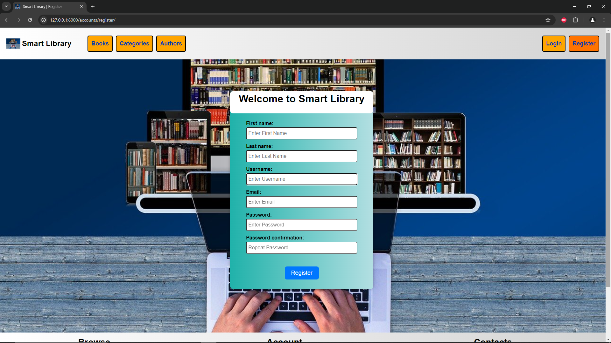

<u><h1>Smart Library</h1></u> 
This is my personal Web Project built with Django Framework. Smart Library is a site for browsing and renting books from different categories. Please register if you want to write a review or rent a book.
<u><h2>Features</h2></u> 
- User authentication and registration
- Uploading a profile photo
- Browsing for books, categories and authors
- Adding, editing and deleting reviews
- Renting books
- User-friendly interface with a responsive design

<u><h2>Screenshots</h2></u> 

